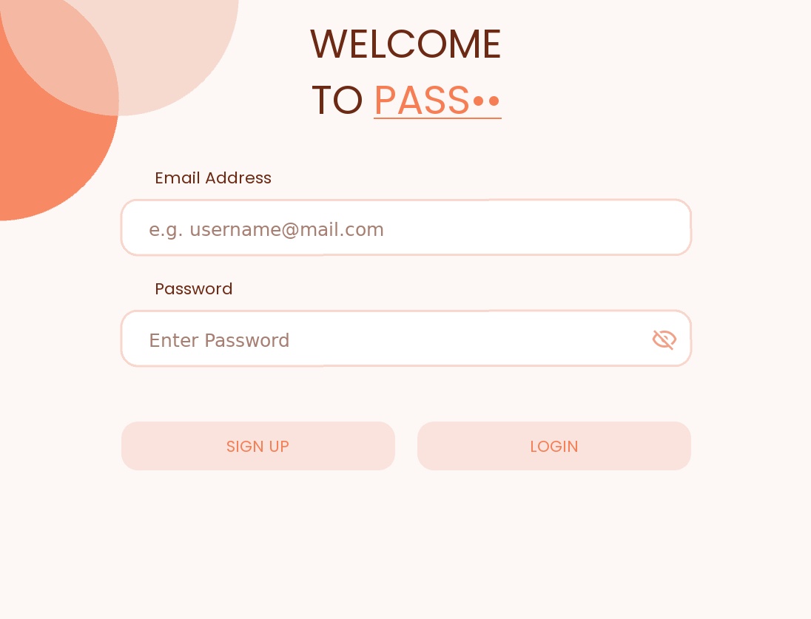
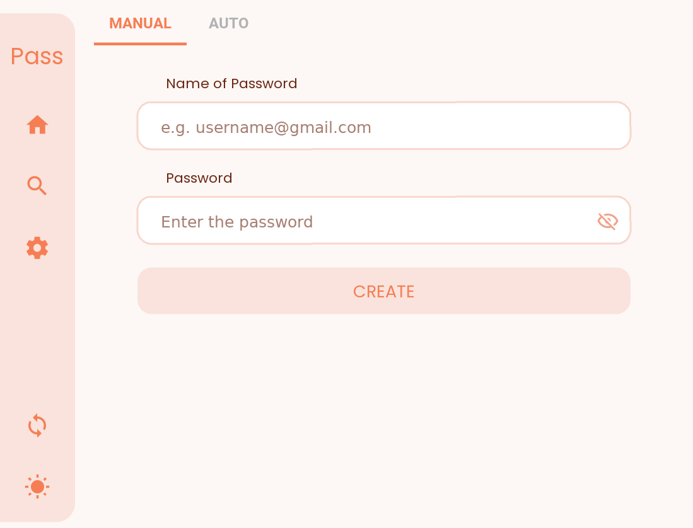
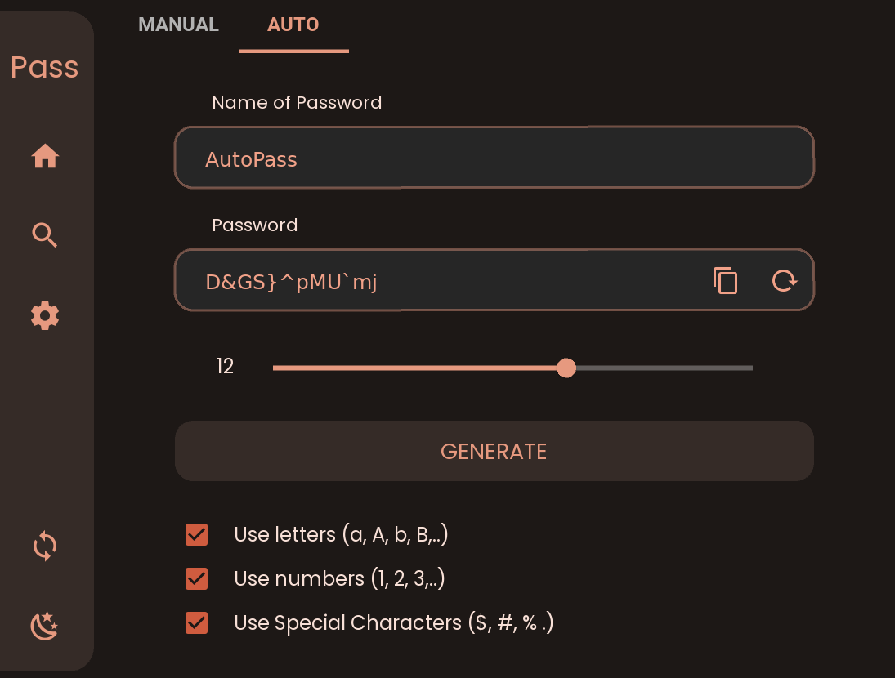
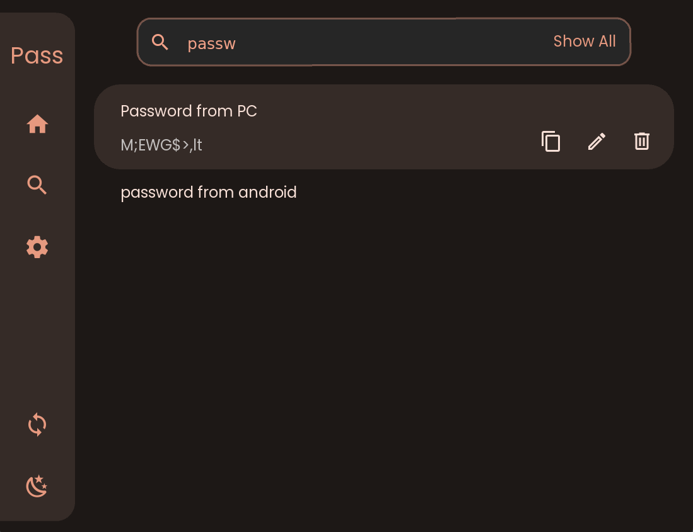
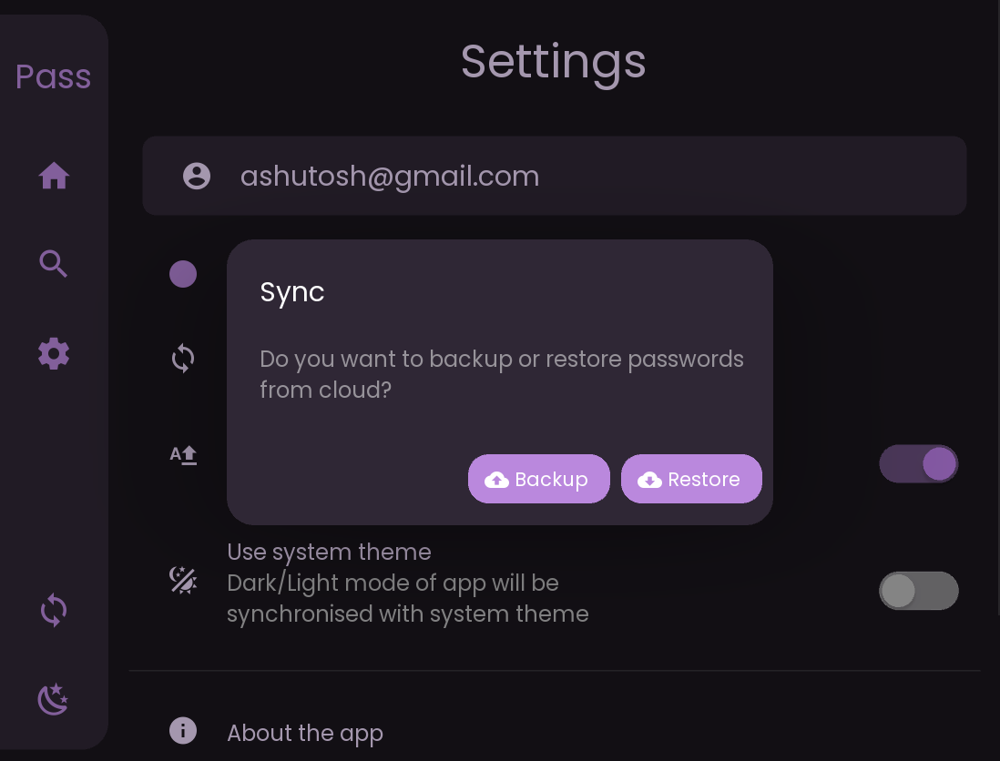
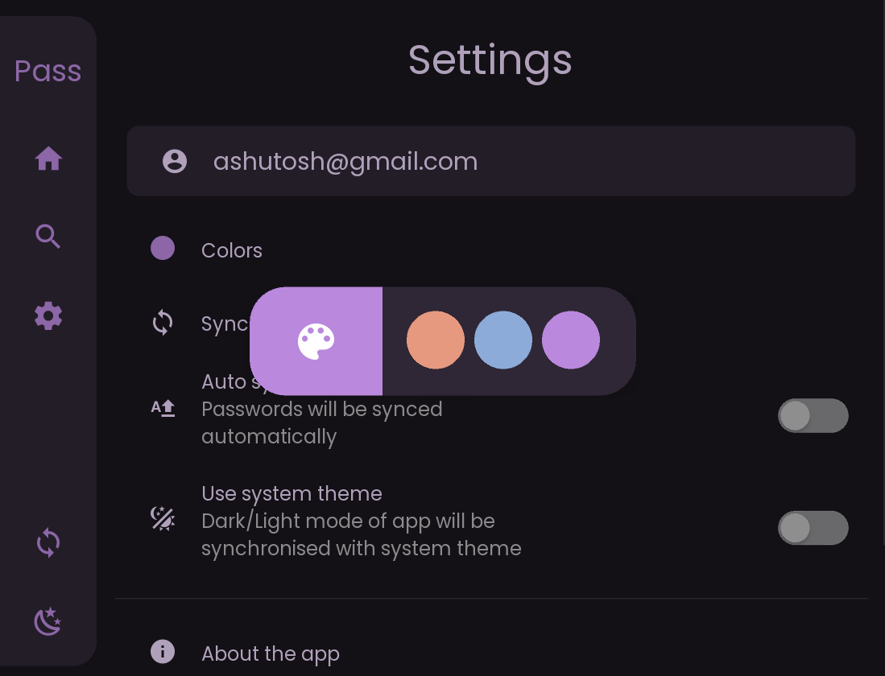

# Passlock for Windows

    

<a href = "https://github.com/AM-ash-OR-AM-I/PasslockDesktop/releases/download/0.2/Passlock.msi"><h1 align="center">
    Get  for 
    </h1> 
</a>

## About
Passlock - A Password manager for Windows.

    <a href="https://github.com/AM-ash-OR-AM-I/Passlock">
        Check out Passlock for Android
    </a>

## Features
* Backup and sync passwords across devices 💻📱.
* Encrypted passwords using AES 128bit for maximum security.
* Mimics Material v3 Monet engine with 🌙 Dark Mode, to use different 🎨 color themes. (Self-made)
* Make strong passwords 🔑 through built in password generator.
* Advanced 🔍 finding algorithm to search for passwords easily.

## Screenshots
<h4 align = "center"> Signup with Passlock </h4>

    
    

<h4 align = "center"> Create Strong Passwords </h4>

    
    

<h4 align = "center"> Backup and Sync </h4>

    
    

### Framework
Uses <a href="https://github.com/kivy/kivy">Kivy as framework,</a>
<a href="https://github.com/kivymd/KivyMD">with KivyMD library</a> .
