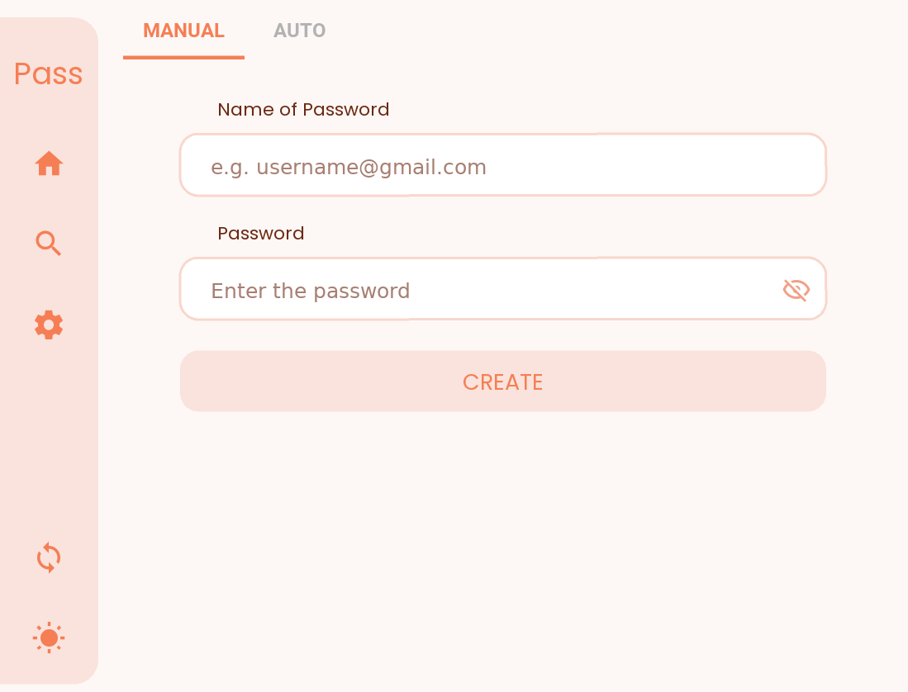

<p align = "center">
    
</p>

### Passlock (PC) - A powerful cross-platform password manager

Run `build_windows.bat` to make windows build, optionally you can set version number by passing it as argument.

## Table of contents

- [Table of contents](#table-of-contents)
- [Features 🌟](#features-)
- [Releases 🚀](#releases-)
  - [Additional steps for linux](#additional-steps-for-linux)
    - [Manually (In case script doesn't work)](#manually-in-case-script-doesnt-work)
  - [Issues](#issues)
- [Setup 🛠️](#setup-️)
- [Packaging 📦](#packaging-)
  - [Automated 🤖](#automated-)
  - [Manually 🧑🏻‍💻 (In case automated build fails)](#manually--in-case-automated-build-fails)
    - [PyInstaller (Windows \& Linux)](#pyinstaller-windows--linux)
      - [Advanced Installer (Windows only MSI Build)](#advanced-installer-windows-only-msi-build)
- [Screenshots 💻](#screenshots-)
- [Frameworks ⚙️](#frameworks-️)


## Features 🌟

- Backup and auto-sync ☁️ passwords across devices 💻📱
- Encrypted 🔐 passwords using AES 128bit for maximum security.
- Mimics Material v3 Monet engine with 🌙 Dark Mode, to use different 🎨 color themes.
- Make strong passwords 🔑 through built in password generator.
- Advanced 🔍 finding algorithm to search for passwords easily.

## Releases 🚀

See all releases 📥 for Windows 🪟 and Linux 🐧 [here.](https://github.com/AM-ash-OR-AM-I/PasslockDesktop/releases/)

### Additional steps for linux

- Extract files to dir using `tar -xzvf passlock.tar.gz -C <output_path>`
- `cd passlock` & Just run `./install.sh` inside the passlock folder
  - It will ask for sudo password to create a softlink.
  - This will add a menu item and make passlock accessible through terminal anywhere
  - try `$ passlock` or run from menu.

#### Manually (In case script doesn't work)

<details>
<summary>Creating a soft link</summary>
After installing and extracting .tar.gz file in linux to run app anywhere in terminal we can create a softlink like this:

```$ ln -s /path/to/passlock/Passlock /usr/local/bin/passlock```

After this we can run passlock by typing `$ passlock`

</details>
<details>
<summary>Adding menu icon</summary>

```bash
cd ~/.local/share/applications
nano passlock.desktop
```

Paste the following lines by specifying the `/path/to/passlock` in `Exec` and `Icon` fields

```ini
[Desktop Entry]
Encoding=UTF-8
Version=1.3.0
Type=Application
Terminal=false
Exec=/path/to/passlock/Passlock
Name=Passlock
Icon=/path/to/passlock/pass.png
```

Now app can be launched from applications menu
</details>

### Issues

In linux you may face issues with app not starting, it's likely if `xrandr` isn't installed.
- Install `xrandr` by `$ sudo dnf xrandr` in fedora or `$ sudo apt xrandr` in ubuntu

## Setup 🛠️

- Clone repo `git clone https://github.com/AM-ash-OR-AM-I/PasslockDesktop.git` & `cd PasslockDesktop`
- Run the following command in terminal to install dependencies in a virtual environment.

```sh
pip install --upgrade pip
python -m venv env
env\Scripts\activate
python -m pip install -r requirements.txt
```

- Copy kivymd folder to site-packages
  - Windows: `xcopy kivymd\* env\Lib\site-packages\kivymd\ /E`
  - Linux: `cp -r kivymd/ .</path/to/site-packages>/kivymd/`
- Make a file named `libs\firebase_config.py` with the following content:

```py
import os
os.environ["WEB_API_KEY"] = "[YOUR WEB API KEY HERE]" # Find web api key in firebase project settings
os.environ["DATABASE_URL"] = "[YOUR DATABASE URL HERE]" # Find database url in firebase project settings
```

- To sanity check if everything is working fine, run `python main.py` and see if the app runs.
- Also you can run `pip list` to see if only the packages in `requirements.txt` are installed.

## Packaging 📦

### Automated 🤖

- Run `.\build_windows.bat` to make windows build, optionally you can set version number by passing it as argument.
  - Example: `build_windows.bat 1.3.0`
  - This will first make .exe file using PyInstaller and then make MSI installer inside `Passlock-SetupFiles` folder.
- Run `./build_linux.bat` to make linux `.tar.gz` zip, optionally you can set version number by passing it as argument.

### Manually 🧑🏻‍💻 (In case automated build fails)

#### PyInstaller (Windows & Linux)

- Run `copy_kv_files.py` to copy kv files to `all_files` folder that will be used by PyInstaller.
  - NOTE: Do this every time you make changes to kv files.
- Make sure environment is activated if not run `env\Scripts\activate` or `source env/bin/activate` for linux.
- Pyinstaller command to package app:
  - Windows `pyinstaller passlock_windows.spec --noconfirm`
  - Linux `pyinstaller passlock_linux.spec --noconfirm`
- Output will be in `dist/passlock` folder.

##### Advanced Installer (Windows only MSI Build)

- Download and install <a href="https://www.advancedinstaller.com/downloads.html">Advanced Installer</a>.
- Check to see if path is correct for advanced installer in `make_msi_build.bat` file.
- Run `make_msi_build.bat` to make MSI installer.
- Output will be in `Passlock-SetupFiles` folder.
- Run `Passlock-SetupFiles\Passlock.msi` to install and run app.
  - NOTE: While installing you should not install in `Program Files` or `Program Files (x86)` folder as it will not have write permissions and app will not be able to create database file. Install in `C:\Passlock` or `D:\Passlock` or any other drive.

## Screenshots 💻

| Welcome                              | Home                              |
|--------------------------------------|-----------------------------------|
|  |  |
| Create Strong Passwords              | Find                              |
|       |  |
| Backup and Sync                      | Choose Different Colors           |
|           |      |

## Frameworks ⚙️

Made with 💖 in Python using <a href="https://github.com/kivy/kivy">Kivy</a> as framework, along with
<a href="https://github.com/kivymd/KivyMD">KivyMD</a> library.
