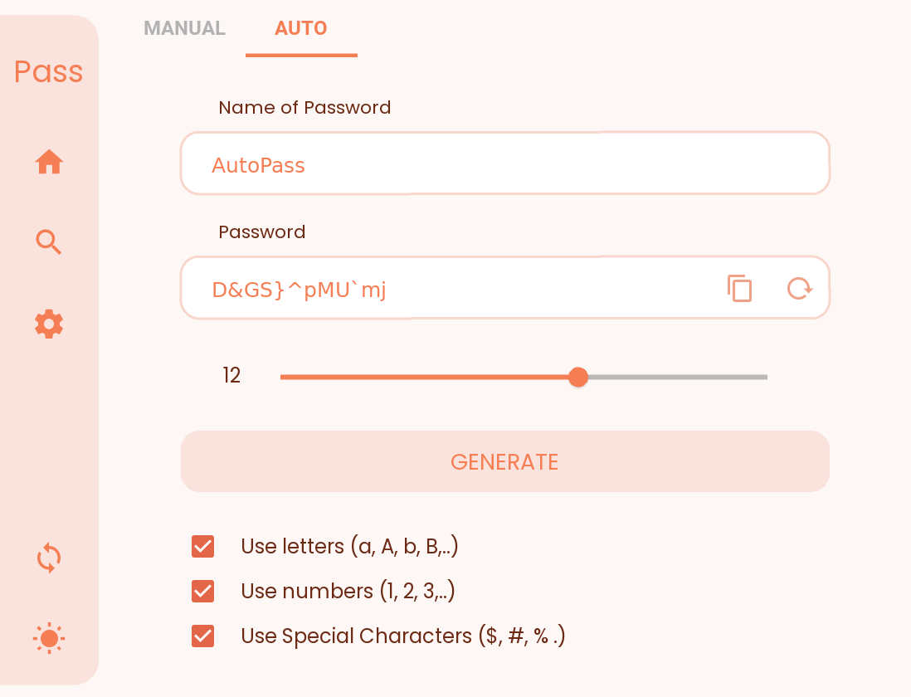

# Passlock for Windows

Passlock - A Password manager for Windows.

<h4 align="left">
    <a href="https://github.com/AM-ash-OR-AM-I/Passlock">
        Check out Passlock for Android
    </a>
</h4>

## Screenshots
<h4 align = "center"> Signup with Passlock </h4>

    
    

<h4 align = "center"> Create Strong Passwords </h4>

    
    

<h4 align = "center"> Dark Mode & different colors </h4>

    
    

<h4 align = "center"> Backup & Sync </h4>

    

